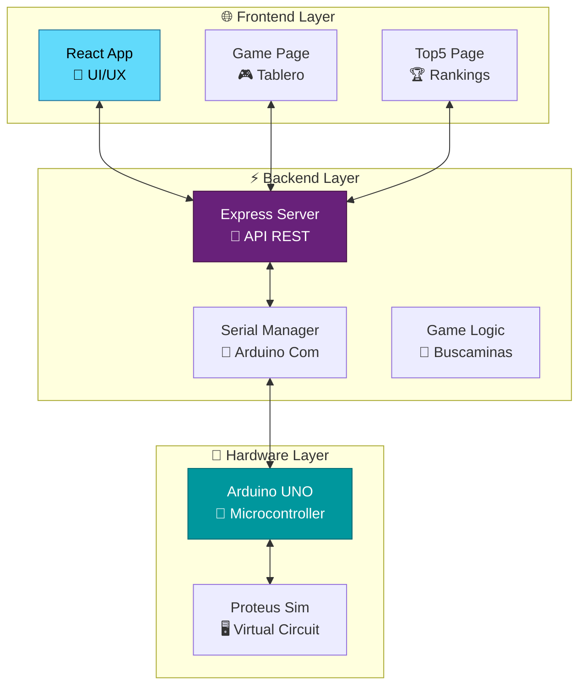

<div align="center">

# 🎮 Buscaminas Arduino 

[](https://reactjs.org/)
[](https://www.typescriptlang.org/)
[](https://www.arduino.cc/)
[](https://www.labcenter.com/)

*Un juego de buscaminas revolucionario que fusiona la experiencia web moderna con controles físicos Arduino*

</div>

---

## 🌟 ¿Qué hace especial a este proyecto?

<table>
<tr>
<td width="50%">

### 🎯 **Experiencia Dual**
Juega desde tu navegador **O** usa controles físicos Arduino - ¡ambos sincronizados en tiempo real!

### 🚀 **Tecnología Moderna**
Stack completo con React, TypeScript y comunicación serial bidireccional

### 🏗️ **Arquitectura Profesional**
API REST robusta con manejo de estados y persistencia de datos

</td>
<td width="50%">

### 📡 **Innovación Hardware**
Simulación completa en Proteus con controles táctiles reales

### 🎮 **Jugabilidad Avanzada**
Sistema de puntuaciones, configuraciones personalizables y análisis sintáctico

### 🔧 **Fácil Setup**
Scripts automatizados y documentación completa para desarrollo

</td>
</tr>
</table>

---

## 🏗️ Arquitectura del Sistema

<div align="center">



</div>

## ✨ Características Principales

<div align="center">

| 🎯 **JUEGO** | 🔧 **CONTROL** | 📡 **COMUNICACIÓN** |
|:---:|:---:|:---:|
| Tablero 4x4 interactivo | Dual: Web + Arduino | Serial en tiempo real |
| **🏆 RANKINGS** | **📁 CONFIGURACIÓN** | **🎨 INTERFAZ** |
| Sistema Top 5 | Carga desde archivo | Moderna y responsive |

</div>

### � **Demo del Juego**

```
┌─────────────────────────────────┐
│  🎯 BUSCAMINAS ARDUINO v1.0     │
├─────────────────────────────────┤
│  ┌───┬───┬───┬───┐              │
│  │ 1 │ 2 │ 💣│ 1 │   🕹️ Controles: │
│  ├───┼───┼───┼───┤   • Click Web   │
│  │ 2 │ 💣│ 3 │ 2 │   • Botones HW  │
│  ├───┼───┼───┼───┤   • Serial CMD  │
│  │ 💣│ 3 │ 2 │ 💣│              │
│  ├───┼───┼───┼───┤   🏆 Score: 850 │
│  │ 1 │ 2 │ 2 │ 1 │   ⏱️ Time: 02:45│
│  └───┴───┴───┴───┘              │
└─────────────────────────────────┘
```

## 🛠️ Stack Tecnológico

<div align="center">

### 💻 **Frontend Moderno**
[](https://reactjs.org/)
[](https://vitejs.dev/)
[](https://www.w3.org/Style/CSS/)

### 🚀 **Backend Robusto**
[](https://www.typescriptlang.org/)
[](https://expressjs.com/)
[](https://nodejs.org/)

### 🔧 **Hardware & Simulación**
[](https://www.arduino.cc/)
[](https://www.labcenter.com/)

</div>

---

## 📋 Prerrequisitos

### Software Requerido

1. **Node.js** (v18 o superior)
2. **TypeScript** (última versión)
3. **Proteus** (última versión)
4. **Virtual Serial Port Driver**
5. **Git** (opcional, para clonar el repositorio)

### Configuración Inicial

- Configurar Virtual Serial Port Driver para simular conexión Arduino
- Tener Proteus instalado y configurado

## 🚀 Guía de Instalación Rápida

<div align="center">

### ⚡ **Setup en 4 pasos simples**

</div>

<table>
<tr>
<td width="25%" align="center">

### 📦 **1. CLONAR**
```bash
git clone <repo-url>
cd PROFINAL_BUSCAMINAS-ARDUINO
```

</td>
<td width="25%" align="center">

### 🔧 **2. BACKEND**
```bash
cd Backend
npm install
```

</td>
<td width="25%" align="center">

### ⚛️ **3. FRONTEND**
```bash
cd ../frontend
npm install
```

</td>
<td width="25%" align="center">

### 🤖 **4. ARDUINO**
- Abrir Proteus
- Cargar `.pdsprj`
- Configurar COM

</td>
</tr>
</table>

---

## ▶️ **Ejecución del Sistema**

<div align="center">

### 🎯 **¡3 terminales, 1 experiencia épica!**

</div>

| **Terminal 1: Arduino** | **Terminal 2: Backend** | **Terminal 3: Frontend** |
|:---:|:---:|:---:|
| 🖥️ Abrir Proteus | 📘 `npx ts-node server.ts` | ⚛️ `npm run dev` |
| 🔌 Iniciar simulación | 🌐 Puerto 3000 | 🎨 Puerto 5173 |
| 📡 Verificar COM | ✅ API funcionando | 🎮 ¡A jugar! |

## 📖 Uso del Sistema

### Interfaz Web
1. **Página Principal**: Navegación entre opciones
2. **Juego**: Tablero interactivo 4x4
3. **Top 5**: Mejores puntuaciones

### Control Arduino
- Controles físicos simulados en Proteus
- Sincronización en tiempo real con interfaz web
- Comunicación bidireccional via puerto serial

### Carga de Configuraciones
- Subir archivos de configuración del tablero
- Formato específico procesado por analizador sintáctico
- Posicionamiento automático de bombas

## 📁 Estructura del Proyecto

```
PROFINAL_BUSCAMINAS-ARDUINO/
├── Arduino/                 # Código y simulación Arduino
│   ├── arduino.ino         # Código principal Arduino
│   └── ProteusFinalORGA.pdsprj # Proyecto Proteus
├── Backend/                # API REST TypeScript
│   ├── backend/
│   │   ├── controllers/    # Controladores API
│   │   ├── routes/        # Rutas Express
│   │   ├── services/      # Servicios y lógica de negocio
│   │   └── config/        # Configuración sistema
├── frontend/              # Aplicación React
│   ├── src/
│   │   ├── pages/         # Páginas principales
│   │   └── assets/        # Recursos estáticos
└── README.md             # Este archivo
```

## 🌐 Endpoints API

Para información detallada sobre los endpoints disponibles, consulte el archivo `endpoints.md`.

### Principales Endpoints
- `GET /api/status` - Estado del servidor
- `POST /api/upload` - Cargar configuración
- `POST /api/addBomb` - Añadir bomba
- `GET /api/gameState` - Estado del juego
- `POST /api/resetGame` - Reiniciar partida

## 🐛 Centro de Solución de Problemas

<div align="center">

### 🔧 **Diagnósticos Rápidos**

</div>

<details>
<summary><strong>❌ Error de conexión serial</strong></summary>

**Síntomas:** Arduino no responde, errores COM

**Soluciones:**
- ✅ Verificar Virtual Serial Port Driver instalado
- ✅ Comprobar puerto COM en configuración (Device Manager)  
- ✅ Reiniciar simulación Proteus completamente
- ✅ Verificar que no hay otros programas usando el puerto

**Comando diagnóstico:**
```bash
# Windows - Listar puertos COM
mode
```

</details>

<details>
<summary><strong>🚫 Backend no inicia</strong></summary>

**Síntomas:** Error al ejecutar `npx ts-node`, dependencias faltantes

**Soluciones:**
- ✅ Verificar Node.js: `node --version` (requiere v18+)
- ✅ Instalar TypeScript globalmente: `npm install -g typescript`  
- ✅ Reinstalar dependencias: `rm -rf node_modules && npm install`
- ✅ Verificar puerto 3000 libre: `netstat -ano | findstr :3000`

**Comando diagnóstico:**
```bash
npm list typescript
npx tsc --version
```

</details>

<details>
<summary><strong>⚛️ Frontend no carga</strong></summary>

**Síntomas:** Pantalla en blanco, errores de Vite

**Soluciones:**
- ✅ Verificar Node.js versión: `node --version`
- ✅ Limpiar cache: `npm run build && rm -rf dist`
- ✅ Verificar puerto 5173: `netstat -ano | findstr :5173`
- ✅ Reinstalar: `rm -rf node_modules package-lock.json && npm install`

**Comando diagnóstico:**
```bash
npm run dev -- --verbose
```

</details>

---

## 👥 Desarrollo

### Scripts Disponibles

**Backend:**
- `npx ts-node server.ts` - Ejecutar en desarrollo

**Frontend:**

- `npm run dev` - Servidor desarrollo
- `npm run build` - Build producción
- `npm run lint` - Verificar código


</div>
